<!-- title: Nesting Tidy Data With D3  -->
# D3 Nest

<!-- description: Data comes structured in many ways, most of them messy. This talk will discuss different ways of converting your data to a tidy format, how to analyze tidy data with d3.nest and other fun d3.nest visualization techniques.  -->
## Visualizing Tidy Data

[1wheel.github.io/talks/d3-nest](http://1wheel.github.io/talks/d3-nest)


<!-- started started as a graphics editor two years ago, facts about me -->
## Adam Pearce
<!-- - [nytimes.com/by/adam-pearce](https://www.nytimes.com/by/adam-pearce) -->
- [roadtolarissa.com](http://roadtolarissa.com)
- [github.com/1wheel](https://github.com/1wheel)
- [@adamrpearce](https://twitter.com/adamrpearce)


## Data is messy
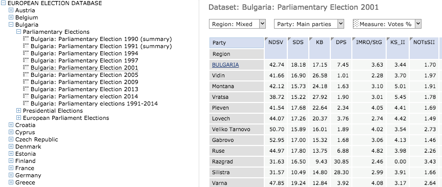


## Data is messy
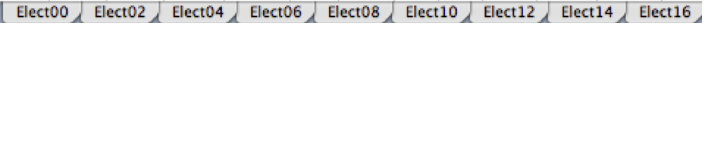


## Data is messy
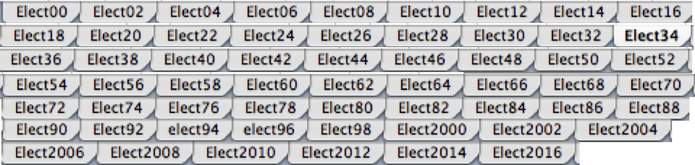


## Data is messy
````
Statistics/AnnualReports/FY2015AnnualReport/FY15AnnualReport-TableXVII.pdf
Statistics/AnnualReports/FY2014AnnualReport/FY14AnnualReport-TableXVII.pdf
Statistics/AnnualReports/FY2013AnnualReport/FY13AnnualReport-TableXVII.pdf
Statistics/AnnualReports/FY2012AnnualReport/FY12AnnualReport-TableXVII.pdf
Statistics/AnnualReports/FY2011AnnualReport/FY11AnnualReport-Table%20XVII.pdf
Statistics/FY10AnnualReport-TableXVII.pdf
Statistics/FY09AnnualReport_TableXVII.pdf
Statistics/FY08-AR-TableXVII.pdf
Statistics/FY07AnnualReportTableXVII.pdf
Statistics/FY06AnnualReportTableXVII.pdf
Statistics/FY05tableXVII.pdf
Statistics/FY04tableXVII.pdf
Statistics/FY2003%20table%20XVII.pdf
Statistics/FY2002%20table%20XVII.pdf
Statistics/FY2001%20table%20XVII.pdf
Statistics/FY2000%20table%20XVII.pdf
````


## Data is messy
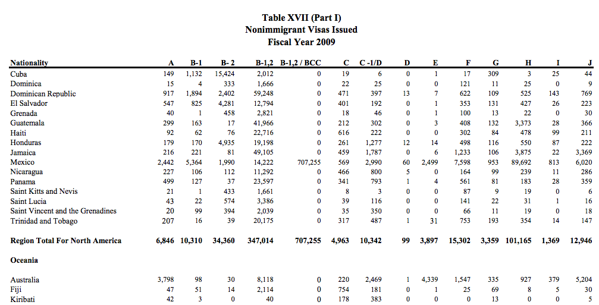


## How should data be structured?
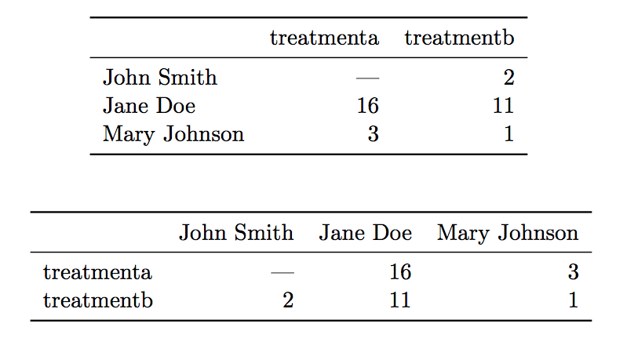

[http://r4ds.had.co.nz/tidy-data.html](http://vita.had.co.nz/papers/tidy-data.pdf)


## Tidy rules

Each _variable_ must have its own column.

[http://r4ds.had.co.nz/tidy-data.html](http://http://r4ds.had.co.nz/tidy-data.html)


## Tidy rules

Each *observation* must have its own row.

[http://r4ds.had.co.nz/tidy-data.html](http://http://r4ds.had.co.nz/tidy-data.html)


## Tidy rules

Each *value* must have its own cell.

[http://r4ds.had.co.nz/tidy-data.html](http://http://r4ds.had.co.nz/tidy-data.html)


## Tidy data
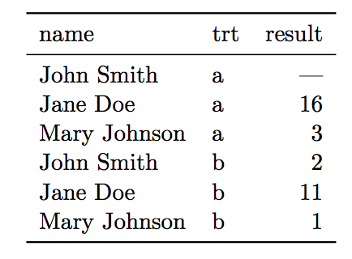

[vita.had.co.nz/papers/tidy-data.pdf](http://vita.had.co.nz/papers/tidy-data.pdf)


## How Far Is Europe Swinging to the Right?
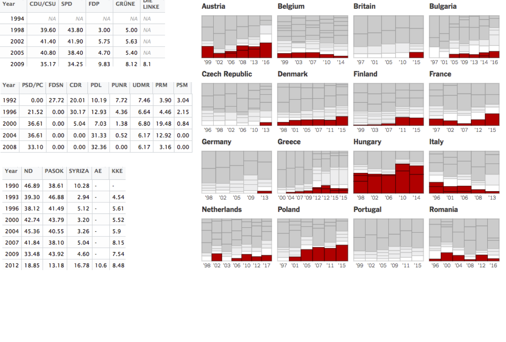


## Transform to tidy data
```
var data = []
glob.sync('raw-csv/*.csv').forEach((path, i) => {
  var elections = d3.csvParse(fs.readFileSync(path, 'utf-8'))
  var country = _.last(path.split('/')).replace('.csv', '')
  
  var parties = election.columns.filter(d => d != 'year')
  d3.cross(parties, elections, (party, election) => {
    data.push({country, party, year: election.year, percent: year[party]})
  })
})
fs.writeFileSync('data.csv', d3.csvFormat(data))
```


## Tidied Data 
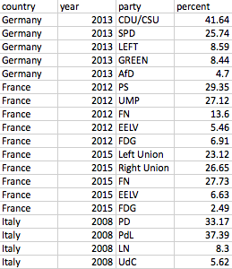

+1,700 more rows


## Load in the client
````
var data = [
  {
    "country": "Romania",
    "year": 2016,
    "party": "PSD",
    "percent": 45.48,
  },
  {
    "country": "Romania",
    "year": 2016,
    "party": "UNPR",
    "percent": 0,
  },
  {
    "country": "Denmark",
    "year": 1998,
    "party": "SF",
    "percent": 7.56,
  }
  ...
]
````


## Group by country
````
var byCountry = d3.nest().key(d => d.country).values(data)

[
  {
    "key": "Romania",
    "values": [
      {
        "country": "Romania",
        "year": 2016,
        "party": "PSD",
        "percent": 45.48
      },
      {
        "country": "Romania",
        "year": 2016,
        "party": "UNPR",
        "percent": 0
      },
    ]
  },
  {
    "key": "Denmark",
    "values": [
      {
        "country": "Denmark",
        "year": 1998,
        "party": "SF",
        "percent": 7.56,
      },
    ]
  },
  ...
]
````


## Add Countries
````
byCountry.sort(d3.ascendingKey(d => d.key))
countrySel = sel.appendMany(byCountry, 'svg')
countrySel.append('text').text(d => d.key)
````
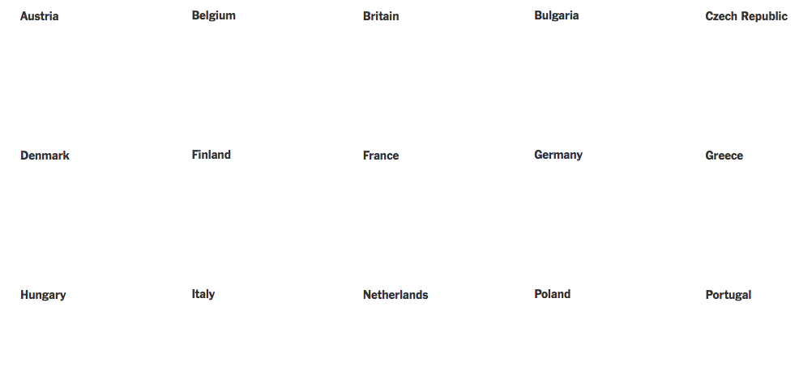


## Group by Year
````
byCountry.forEach(country => {
  country.byYear = d3.nest().key(d => d.year).entries(d.values)
  country.byYear.sort(d3.ascendingKey(d => d.key))
})
````


## Add Years
````
var yearSel = countrySel.appendMany(d => d.byYear, 'g')
  .translate((d, i) => [xScale(i), 0])
yearSel.append('text').text(d =>  '’'' + d.key.substr(2, 2))
````
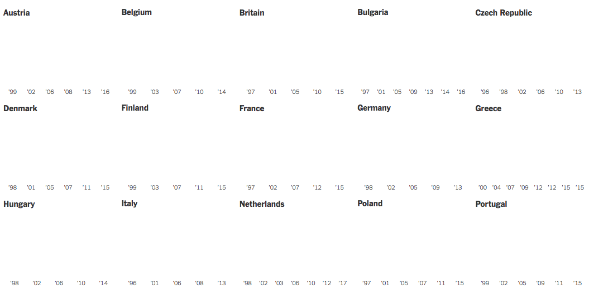


## Calculate party height
````
byCountry.forEach(country => {
  country.byYear.forEach((year, i) => {
    var cumulativePercent = 0
    year.values
      .sort(d3.ascendingKey(d => d.isRight ? 0 : d.isCenter: 2 : 1))
      .forEach(d => {
        cumulativePercent += d.percent
        d.cumulativePercent = cumulativePercent
      })
  })
})
````


## Add parties
````
var partySel = yearSel.appendMany(d => d.values, 'rect')
  .attr('y', d => yScale(d.cumulativePercent))
  .attr('height', d => { yScale(d.cumulativePercent - d.percent) 
                        -yScale(d.cumulativePercent)
  })
  .attr('width', xScale(1))
  .attr('fill', d => d.isRight ? red : d.isCenter: grey : white)
````
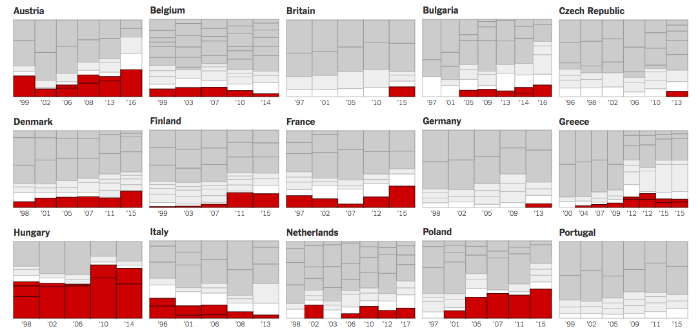


## Keep only what we want
````
data = data
  .filter(function(d){ return d.year > 1996 })
````


## Keep only what we want
````
data = data
  .filter(function(d){ return d.year > 1996 })
  .filter(function(d){ return isPrint || d.country != 'Norway' })
````


## Data Manipulation Verbs

### filter
### sort
### group
### mutate 


## d3.nestBy

````
d3.nestBy = function(array, key){
  return d3.nest()
    .key(key)
    .entries(array)
    .map(function(d){
      d.values.key = d.key
      return d.values
    })
}
````

[github.com/gka/d3-jetpack](https://github.com/gka/d3-jetpack)


## NBA Win/Loss

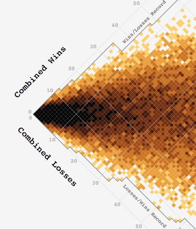

[roadtolarissa.com/nba-win-loss](http://roadtolarissa.com/nba-win-loss/)


## Aggregate, then display

```
console.log(games.length) //55774

var byWinLoss = d3.nestBy(games, d => d.tW + ':' + d.tL)
byWinLoss.forEach(function(d){
  d.tW = d[0].tW
  d.tL = d[0].tL
})

svg.appendMany(byWinLoss, 'rect')
    .translate(d => [x(d.tL), y(d.tW)])
    .attr('fill', d => color(d.length))
```


## Derive new data

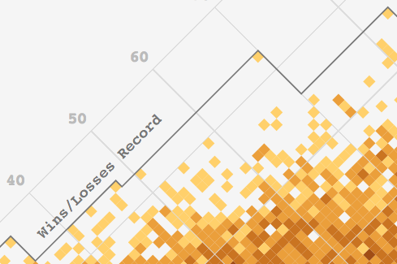

```
var recordBests = []
d3.nestBy(byWinLoss, d => d.tW).forEach(function(byWins){
  var best = _.sortBy(byWins, d => 'tL')[0]
  if (_.last(recordBests).tL < best.tL){ recordBests.push(best) }
})
```


## Useful without data

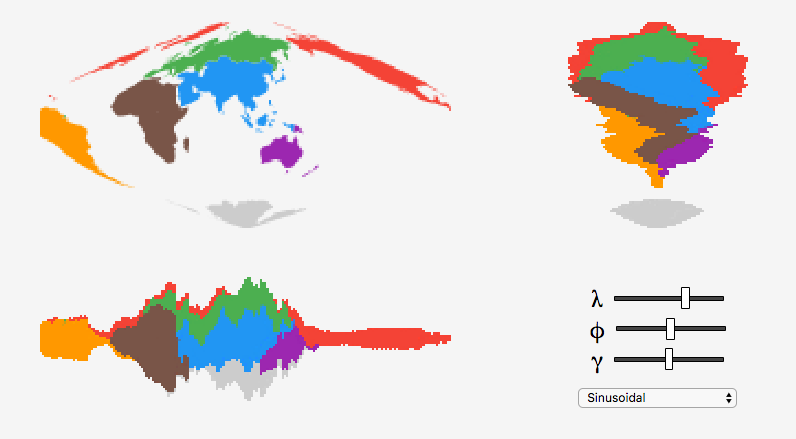

[roadtolarissa.com/projecting-land](http://roadtolarissa.com/projecting-land/)


## Merge continents 

```
d3.json('world-110m.json', function(err, world){
  var continents = d3.nestBy(
      world.objects.countries.geometries, 
      d => d.properties.continent
    ).map(d => topojson.merge(world, d))

  // only 7 shapes to draw now
  d3.timer(() => {
    continents.forEach((d, i) => {
      ctx.fillStyle = colors[i]
      ctx.beginPath(), path(d), ctx.fill()
    })
  })
```


## Look up color at each pixel  

```
var img = ctx.getImageData(0, 0, width, height).data

var pts = []
for (var x = 0; x < width; x += 1) {
  for (var y = 0; y < height; y += 1) {
    var i = (x + y*width)*4
    if (img[i] > 2) pts.push([x, y, img[i], img[i + 1], img[i + 2]])
  }
}
```


## Group by Y position to calculate X position

```
d3.nestBy(pts, d => d[1])
  .forEach(row => {
    row.forEach(function(d, i){
      d.x = i + width/2 - row.length/2
    })
  })
```


## Draw by color

```
d3.nestBy(pts, d => 'rgb(' + [d[2], d[3], d[4]] + ')')
  .forEach(d => {
    ctx2.fillStyle = d.key
    ctx2.beginPath()
    d.forEach(d => ctx2.rect(d.x, d[1], s*1, s*1) )
    ctx2.fill()    
  })
```


## Fun things to read
- [r4ds.had.co.nz](http://r4ds.had.co.nz)
- [roadtolarissa.com/data-exploration](http://roadtolarissa.com/data-exploration)
- [roadtolarissa.com/stacked-bump](http://roadtolarissa.com/stacked-bump)
- [learnjsdata.com](http://learnjsdata.com/)
- [Mister Nester](http://bl.ocks.org/shancarter/raw/4748131/)


# misc tk delete delete delete

var rectSel = yearSel.appendMany(d => d.values, 'rect')
  .classed('poll', function(d) { return d.electionType == 'poll'; })
  .attr('x', ƒ('yearIndex', c.x))
  .attr('width', c.x(1))
  .attr('y', ƒ('cumulativePercent', c.y))
  .attr('height', function(d){
    return -c.y(d.cumulativePercent) + c.y(d.cumulativePercent - d.percent) })
  .attr('fill', fill)
  .style('stroke', stroke)
  .call(d3.attachTooltip)
  .on('mouseover.highlight', function(d){
    var html
    var party = nytPartyNames[d.country+'_'+d.party] || d.party.replace('Other', 'Other parties')
    if (d.electionType != 'poll'){
      html = [party, 'won', Math.round(d.percent), 'percent of the vote in ', d.year].join(' ')
    } else{
      html = [party, d.party == 'Other' ? 'are': 'is', 'currently polling at ', Math.round(d.percent), 'percent for', d.year].join(' ')
    }

    d3.select('.tooltip').html(html)
  })
````

