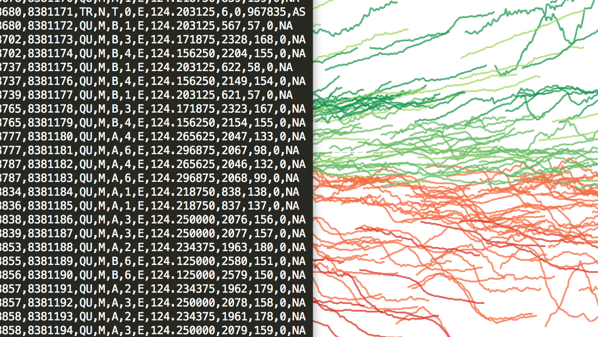
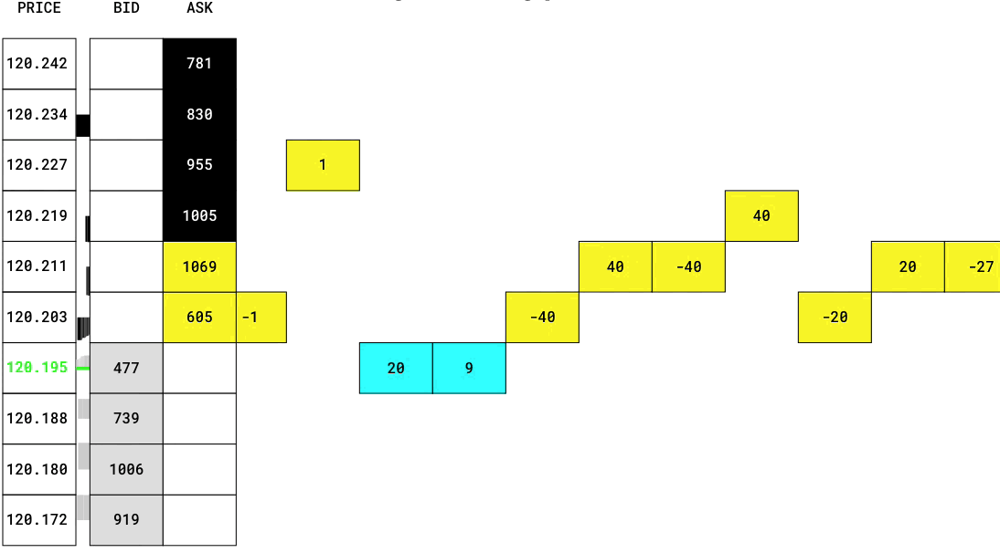
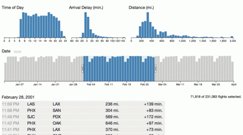
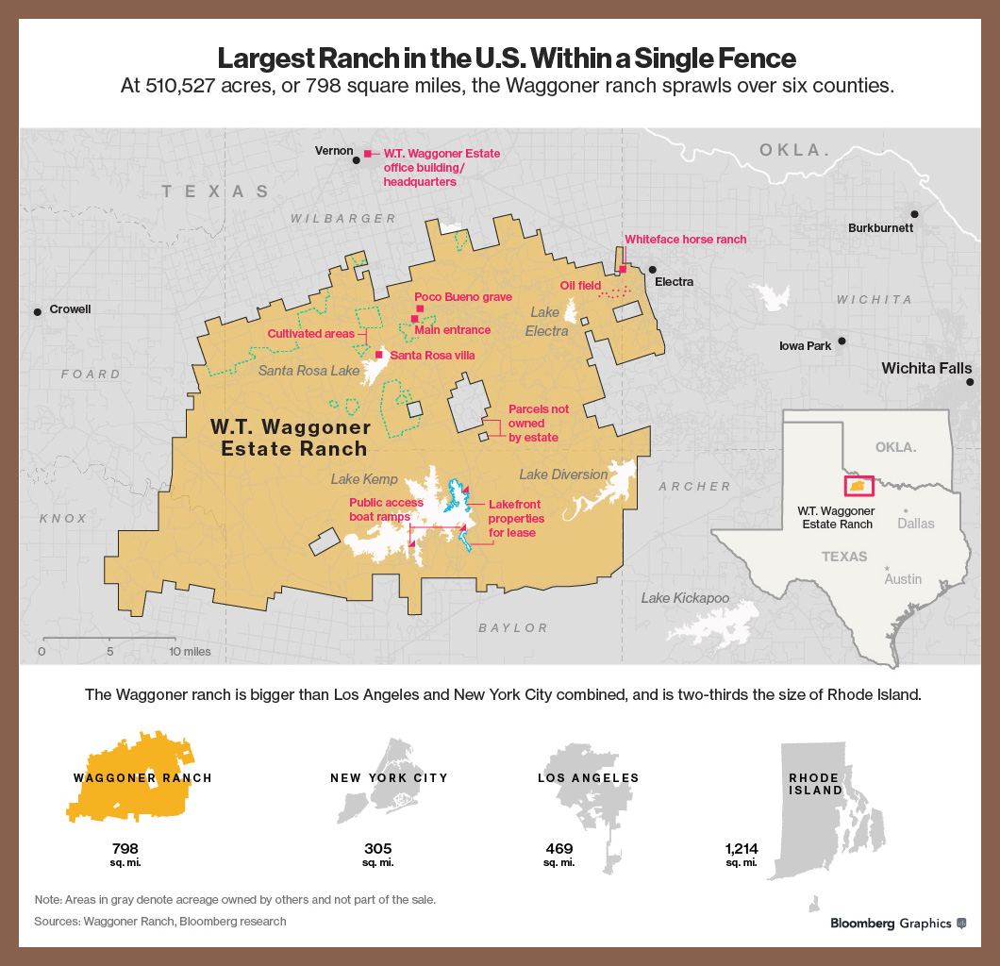

# Manual and programmatic manipulation of SVGs

<!-- [1wheel.github.io/talks/graphical-web](http://1wheel.github.io/talks/graphical-web/#/) -->

<m style='font-size: 20px; position: relative; top: 100px;'>Copyright 2015 Bloomberg L.P. All rights reserved</m>

## Adam Pearce
- [roadtolarissa.com](http://roadtolarissa.com)
- [bloomberg.com/graphics](https://bloomberg.com/graphics)
- [github.com/1wheel](https://github.com/1wheel)
- [@adamrpearce](https://twitter.com/adamrpearce)

<!-- Over the last few years, the acceleration of client-side javascript and development of D3 has enabled the creation of increasingly sophisticated interactive visualizations. Transforming data into an SVG with D3 makes many previously difficult tasks trivial. But other tasks -- like text positioning, layout and illustration -- are much easier with tools designed for manually manipulating SVGs, like Illustrator or Inkscape. This talk will discuss different techniques that Bloomberg Graphics uses to combine the two approaches.  -->

## D3 is great at encoding data

[How the Recession Reshaped the Economy, in 255 Charts](http://www.nytimes.com/interactive/2014/06/05/upshot/how-the-recession-reshaped-the-economy-in-255-charts.html
)

## D3 is great at animating data

[bloomberg.com/graphics/2015-spoofing](http://www.bloomberg.com/graphics/2015-spoofing
)

## D3 is great for interacting with data

[square.github.io/crossfilter](http://square.github.io/crossfilter/)

## D3 struggles with annotations

[bloomberg.com/graphics/2015-famous-texas-waggoner-ranch-for-sale/](http://www.bloomberg.com/graphics/2015-famous-texas-waggoner-ranch-for-sale/)

## D3 struggles with layout

## D3 struggles with illustration

<!-- By strategically placing illustrated elements in groups and loading an SVG in a browser, we can add rudimentary animations with d3.timer and d3.transition. Smoothly changing transform, translate and/or rotate over time creates the illusion of movement. Toggling the opacity of an arm or another object drawn in two different positions also brings static images to life.  -->

## Adding Animation

[bloomberg.com/graphics/2015-march-madness-gambling](http://www.bloomberg.com/graphics/2015-march-madness-gambling/)

## Load the SVG

Client Side

    d3.xml("gambling.svg", "image/svg+xml", function(xml){
      var el = d3.select('#svg-container')
      el.node().appendChild(xml.documentElement)
    })

Build Step (works with IE9)

    var html = fs.readFileSync('src.html',     'utf-8')
    var svg  = fs.readFileSync('gambling.svg', 'utf-8')
    html = html.replace("id='svg-container'>
", 
                        "id='svg-container'>" + svg + "
")

    fs.writeFileSync('index.html', html)

## Arm Wave

    d3.timer(function(t){
      d3.select('#arm2a').classed('visable', t % 1000 <  700)
      d3.select('#arm2b').classed('visable', t % 1000 >= 700)
    })

## Arm Rotation

    d3.timer(function(t){
      d3.select('#svg2 #arm1').attr('transform', 
        'rotate(' + Math.cos(t/800)*10 + ' 320 250)')
    })

## Animating Bars

[bloomberg.com/graphics/2015-march-madness-basketball-fund/](http://www.bloomberg.com/graphics/2015-march-madness-basketball-fund/)

<!-- Beyond creating gif-like loops (with vectors and a full color palette), SVG animations can be trigged by user interactions. Changing the stroke-dashoffset while scrolling down the page looks quite nice while being simple to implement. Bar charts are also easy to add a flourish to - just save the drawn heights, set the heights to 0 on load and use a staggered transition to move them back to their original positions. -->

## Animating Bars

Save <m>height</m> and <m>y</m>, then set both to 0
 

    d3.selectAll("#tv-revenue rect").each(function(){
      var sel = d3.select(this)
      var d = {height: sel.attr('height'), y: sel.attr('y')}

      sel.attr({height: 0, y: d.y + d.height})
          .datum(d)
    })

Transition <m>height</m> and <m>y</m> back to original values
 

    function animate(){
      d3.selectAll("#tv-revenue rect")
        .transition().delay(function(d, i){ return i*25 + 200 })
          .attr('height', function(d){ return d.height })
          .attr('y',      function(d){ return d.y })
    }

## Adding Scroll Interaction

Create array of animation objects
 

    var animations = []
    animations.push({
      animateFn: animate, 
      startHeight: d3.selectAll("#tv-revenue").node()
                     .getBoundingClientRect().top 
                     - pageYOffset - innerHeight*1/2
    })

Animate when scrolled into view
 

    d3.select(window).on('scroll.lineAnimate', function(){
      animations
        .filter(function(d){
          return !d.started && d.startHeight < pageYOffset })
        .forEach(function(d){
          d.started = true
          d.animateFn()
        })
    })

## Lots of possibilities

- Clip Path
- Stroke Dash Array
- Transform
- ??? 

[bloomberg.com/graphics/2015-nfl-super-bowl-salary/](http://www.bloomberg.com/graphics/2015-nfl-super-bowl-salary/)

<!-- ####There and Back Again
In addition to creating SVGs from scratch in Illustrator and animating them with D3, we've also used D3 to transform data to an SVG, then saved the SVG and opened it with Illustrator to clean up positioning. This technique is particularly useful for tidying up force layouts. 
 -->

## Freezing a force layout

<!-- ####Work Flow
SVGs can be saved from the browser with SVG crowbar or copying and pasting 'Edit as HTML.' It's a little trickier to load SVGs in the browser. d3.xml can load and append an SVG to the page, but it doesn't work with IE9 and adds a network so a build step might be necessary.  
 -->

## D3 -> SVG

- [SVG Crowbar](http://nytimes.github.io/svg-crowbar/)

- Or copy/paste from the element inspector

## SVG -> Coordinates 

Position each circle in illustrator

Convert to circles to coordinates

    d3.range(slides).forEach(function(num){
      d3.xml('svg/' + num + '.svg', function(svg){
        d3.select(svg).selectAll('#auto-group > g').each(function(){
          var el = d3.select(this)
          var datum = _.findWhere(data, {modelNum: el.attr('id')})

          var x = el.attr('transform').split(',')[0].split('(')[1]
          var y = el.attr('transform').split(',')[1].split(')')[0]

          datum[num + 'pos'] = [x, y].map(Math.round)
        })
      })
    })

Render with D3

## Frozen force layout 

http://www.bloomberg.com/graphics/2015-auto-sales/

<!-- If you just need to position things, d3.drag is a solid alternative to Illustrator. For a few elements, console.log the coordinates and copy/paste to a config file; for a lot, save the positions to an array of objects and save to a csv with copy(d3.csv.format(positions)). -->
## Position labels with D3

    var drag = d3.behavior.drag()
        .on('drag', function(d){
          var pos = d3.mouse(c.svg.node())
          var x = pos[0] - d3.select(this).attr('x')
          var y = pos[1] - d3.select(this).attr('y')
          var offset = [x, y].map(Math.round)

          labelOffsets[d.name] = offset
          d3.select(this).translate(offset)
        })

    c.svg.selectAll('text.name').call(drag)

Save with copy/paste

    
    copy(playerLabelOffsets)

[roadtolarissa.com/stacked-bump](http://roadtolarissa.com/stacked-bump/)

Don't be afraid to experiment with creating your own tools - shrinking the feedback loop between making a change and seeing pays off in unexpected ways.

## Responsive

We use viewport resizing or css transform scale until the text gets too small and then switch to fallback images. ai2html has a more robust solution, converting text elements to absolutely positioned divs that support text wrapping. 

## More examples

http://www.bloomberg.com/graphics/2015-pace-of-social-change/

http://www.bloomberg.com/politics/graphics/2014-who-votes-in-midterms/

http://www.bloomberg.com/graphics/2015-irs-income-tax/

## Related work
- [ai2html.org/](http://ai2html.org/)
- [github.com/svg/svgo](https://github.com/svg/svgo)
- [github.com/bendc/animateplus](https://github.com/bendc/animateplus)
- [maxwellito.github.io/vivus](http://maxwellito.github.io/vivus/)
- [snapsvg.io](http://snapsvg.io/)
- [bonsaijs.org](https://bonsaijs.org/)
- 
