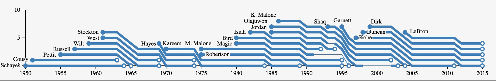

# Reusable d3 with jetpack & starterkit

[1wheel.github.io/nyc-d3](http://1wheel.github.io/nyc-d3/#/)


## Adam Pearce
- [roadtolarissa.com](http://roadtolarissa.com)
- [bloomberg.com/graphics](https://bloomberg.com/graphics)
- [github.com/1wheel](https://github.com/1wheel)
- [@adamrpearce](https://twitter.com/adamrpearce)


## Scatter Plot I


[bl.ocks.org/1wheel](http://bl.ocks.org/1wheel/98129315d0f7df3b53e3)


##Great, but...
- 80 lines & 2284 characters of js

- Reuse conventions with copy/paste


##d3-jetpack


- [github.com/gka/d3-jetpack](https://github.com/gka/d3-jetpack)


##appending with class
Before

````javascript
var legend = svg.selectAll(".legend")
    .data(color.domain())
  .enter().append("g")
    .attr("class", "legend")
````

After

````javascript
var legend = svg.selectAll(".legend")
    .data(color.domain())
  .enter().append("g.legend")
````


##appending with class
Works with ids and multiple classes

Before

````javascript
svg.append("g")
    .attr("class", "y axis")
    .call(yAxis)
  .append("text")
    .attr("class", "label")
````

After

````javascript
svg.append("g.y.axis")
    .call(yAxis)
  .append("text.label")
````


##translate
Before

````javascript
svg.append("g.x.axis")
    .attr("transform", "translate(0," + height + ")")
````

After

````javascript
svg.append("g.x.axis")
    .translate([0, height])
````


##translate
Functions called w/ bound data and index

Before

````javascript
legend
    .attr("transform", function(d, i){
      return "translate(0," + i * 20 + ")" })
````

After

````javascript
legend
    .translate(function(d, i){ return [0, i*20] })
````


##ƒIELD ACCESSOR
Turns a string into a function

````javascript
function ƒ(str){
  return function(object){
    return object[str]
  }
}
````

Returns properties from objects

````javascript
var collie = {color: 'brown', legs: 4}
var spider = {color: 'black', legs: 8}

ƒ('color')(collie)      //'brown'
ƒ('color')(spider)      //'black'

ƒ('legs')(spider)       //8
````


##ƒIELD ACCESSOR

Before

````javascript
x.domain(d3.extent(data, function(d) { return d.sepalWidth; }))
y.domain(d3.extent(data, function(d) { return d.sepalLength; }))
````

After

````javascript
  x.domain(d3.extent(data, ƒ('sepalWidth')))
  y.domain(d3.extent(data, ƒ('sepalLength')))
````


##Compose
Combines two functions together 

````javascript
function compose(g, h){
  return function(object){
    return h(g(object))
  }
}

function add10 (n){ return 10 + n }
function double(n){ return  2 * n }

compose(ƒ('legs'), add10) (collie)  //4 + 10 = 14
compose(ƒ('legs'), add10) (spider)  //8 + 10 = 18
compose(ƒ('legs'), double)(spider)  //8 * 2  = 16
````


##ƒIELD ACCESSOR

Before

````javascript
dots
    .attr("cx", function(d) { return x(d.sepalWidth); })
    .attr("cy", function(d) { return y(d.sepalLength); })
    .style("fill", function(d) { return color(d.species); })
````

After

````javascript
dots
    .attr("cx", compose(ƒ('sepalWidth'), x))
    .attr("cy", compose(ƒ('sepalLength'), y))
    .style("fill", compose(ƒ('species'), color))
````


##ƒIELD ACCESSOR
Converts strings to functions and composes

````
ƒ('legs', add10) (collie)           //4 + 10 = 14
ƒ('legs'), double)(spider)          //8 * 2  = 16
ƒ(add10, double, add10)(3)          //((3 + 10) * 2 ) + 10 = 36
ƒ()(3)                              //3
````


##ƒIELD ACCESSOR
Before

````javascript
dots
    .attr("cx", compose(ƒ('sepalWidth'), x))
    .attr("cy", compose(ƒ('sepalLength'), y))
    .style("fill", compose(ƒ('species'), color))
````

After

````javascript
dots
    .attr("cx", ƒ('sepalWidth', x))
    .attr("cy", ƒ('sepalLength', y))
    .style("fill", ƒ('species', color))
````


##ƒIELD ACCESSOR
Also works as an identity function

Before

````javascript
legend.append("text")
    .text(function(d) { return d })
````

After

````javascript
legend.append("text")
    .text(ƒ())
````


##d3-starterkit
Snippets and conventions for starting a new d3 project

[github.com/1wheel/d3-starterkit](https://github.com/1wheel/d3-starterkit)


##dataAppend
Before

````javascript
svg.selectAll(".dot")
    .data(data)
  .enter().append("circle.dot")
````

After

````javascript
svg.dataAppend(data, "circle.dot")
````


##dataAppend
````javascript
d3.selection.prototype.dataAppend = function(data, name){
  return this.selectAll(name)
      .data(data).enter()
    .append(name)
````


##dataAppend
Before

````javascript
var legend = svg.selectAll(".legend")
    .data(color.domain())
  .enter().append("g.legend")
````

After

````javascript
legend = svg.dataAppend(color.domain(), "g.legend")
````


##d3.conventions - margins
Before

````javascript
var margin = {top: 20, right: 20, bottom: 30, left: 40},
    width = 960 - margin.left - margin.right,
    height = 500 - margin.top - margin.bottom;

var svg = d3.select("body").append("svg")
    .attr("width", width + margin.left + margin.right)
    .attr("height", height + margin.top + margin.bottom)
  .append("g")
    .attr("transform", 
      "translate(" + margin.left + "," + margin.top + ")")
````

After
````javascript
var c = d3.conventions({
  margin: {top: 20, right: 20, bottom: 30, left: 40},
  width:  900,
  height: 450,
})

c.svg.dataAppend(data, "circle.dot")
````


##d3.conventions - scales
Creates and sets the domain for x and y scales

Before

````javascript
var x = d3.scale.linear()
    .range([0, width])
    .domain(d3.extent(data, ƒ('sepalWidth')))

var y = d3.scale.linear()
    .range([height, 0])
    .domain(d3.extent(data, ƒ('sepalLength')))
````

After
````javascript
c.x.domain(d3.extent(data, ƒ('sepalWidth')))
c.y.domain(d3.extent(data, ƒ('sepalLength')))
````


##d3.conventions - axis
Creates and configures x and y axis

Before

````javascript
var xAxis = d3.svg.axis()
    .scale(x)
    .orient("bottom");

````

After
````javascript
console.log(c.xAxis.orient())        //"bottom"
````


##d3.conventions - axis
Draws x and y axis

Before

````javascript
svg.append("g.x.axis")
    .translate([0, height])
    .call(xAxis)
  .append("text.label")
    .attr("x", width)
````

After
````javascript
c.drawAxis()

c.svg.select('.x.axis')
  .append("text.label")
    .attr("x", c.width)
````


##Significantly shorter
[Scatter II](http://bl.ocks.org/1wheel/7e473c251e68ce760e2a)
- Conventions can be used without copy/paste
- 49 lines and 1309 characters of javascript
- 31 lines just to draw the axis label and legend


##Minimally viable (scatter) plot 
[Scatter III](http://bl.ocks.org/1wheel/3dfee2b74943398f0550)

````
d3.tsv("data.tsv", function(data) {
  var c = d3.conventions()
  c.x.domain(d3.extent(data, ƒ('sepalWidth')))
  c.y.domain(d3.extent(data, ƒ('sepalLength')))

  c.drawAxis()

  c.svg.dataAppend(data, "circle.dot")
      .attr("r", 3.5)
      .attr("cx", ƒ('sepalWidth', c.x))
      .attr("cy", ƒ('sepalLength', c.y))
      .style("fill", ƒ('species', c.color))
})
````


##There's more!
- d3.attachTooltip
- d3.wordWrap
- d3.???


##Tutorials


[roadtolarissa.com/stacked-bump](http://roadtolarissa.com/stacked-bump/)

[roadtolarissa.com/data-exploration](http://roadtolarissa.com/data-exploration/)


## Related work
- [github.com/sarahgp/data-monster](https://github.com/sarahgp/data-monster)
- [github.com/twitter/d3kit](https://github.com/twitter/d3kit)
- [github.com/rollup/rollup](https://github.com/rollup/rollup)
- [github.com/uwdata](https://github.com/uwdata)
- 

<!-- 
## Outline 
- `append('name.class`): axis, circle, legend
- `translate`: x axis, legend
- `ƒ`: scales, identity for text, compose attrs
- `appendData`: circle, legend
- `conventions`: margin, scale, axis
 -->