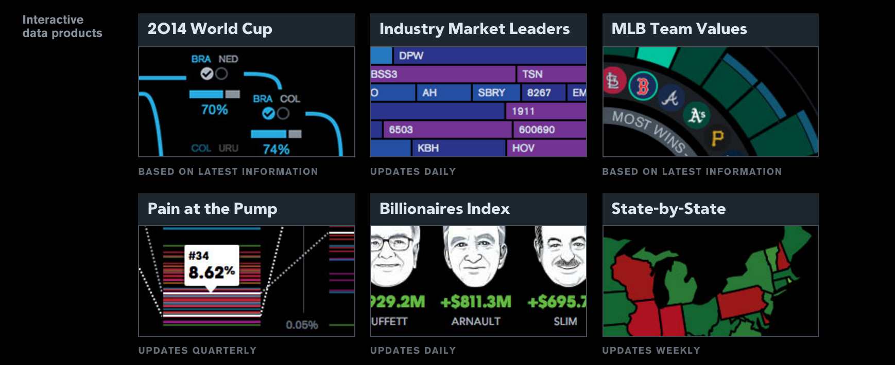

# Tiny Tools

## Writing Reusable D3

[1wheel.github.io/talks/tiny-tools](http://1wheel.github.io/talks/tiny-tools/#/)

## Adam Pearce
- [roadtolarissa.com](http://roadtolarissa.com)
- [github.com/1wheel](https://github.com/1wheel)
- [@adamrpearce](https://twitter.com/adamrpearce)

e
<!-- started at bloomberg two years ago, hired to develop explorative interactive data products -->
## 

<!-- complex interactions with lots of screens -->
##

<!--  -->
## Big tools

Within a project, reuse code with compentent
Between projects, reuse framework abstractions

