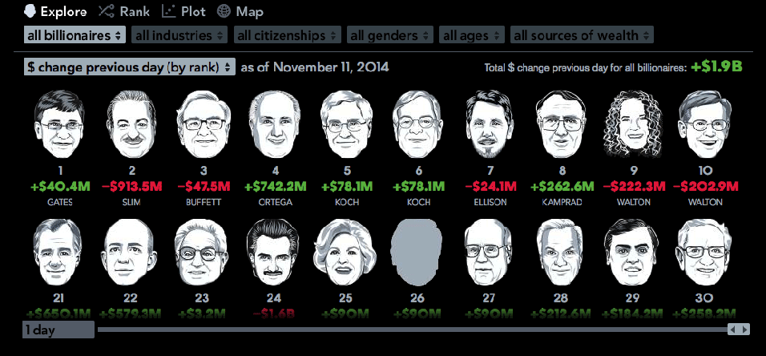

# Tiny Tools

## Writing Reusable D3

[1wheel.github.io/talks/tiny-tools](http://1wheel.github.io/talks/tiny-tools/#/)


## Adam Pearce
- [roadtolarissa.com](http://roadtolarissa.com)
- [github.com/1wheel](https://github.com/1wheel)
- [@adamrpearce](https://twitter.com/adamrpearce)


<!-- started at bloomberg two years ago, hired to develop explorative interactive data products -->
## 

[bloomberg.com/visual-data](http://www.bloomberg.com/visual-data)


<!-- complex interactions with lots of screens -->

[bloomberg.com/billionaires](http://www.bloomberg.com/billionaires/)


<!--  -->
## Big tools


- Within a project, reuse code with components

- Between projects, reuse framework abstractions


<!--  start to publish interactive work on a weekly and daily basis intead of monthly. 

tk tk published in 2015!
-->
## Transitioning to a traditional graphics desk
<video src='img/2015.mov' autoplay loop style='max-width: 600px; margin: 0px auto;'></video>

[bloomberg.com/graphics/2015-in-graphics](http://www.bloomberg.com/graphics/2015-in-graphics/)


<!-- big frameworks become too unwieldly 
  
  - too many abstractions 
  - don't need to manage complex state 
  - working directly with DOM is hacky

  - high fixed cost to starting a new project
  - barrier to entry; want designers and reporters

default on techiqal debt!
-->
## frameworks become unwieldy 
  - unnecessary abstractions 
  - higher barrier to entry


<!--  -->
## reusing code is trickier
- start project by copying/pasting bl.ocks 
- forage through old code for useful bits & bobs


<!-- working with much lower primatives than ggplot or something - tons of flexablitiy, but even doing something simple is hard -->
## d3 is verbose

'simple' scatterplot: 48 lines and 1398 characters of code
````
d3.tsv('data.tsv', function(error, data) {
  var margin = {top: 20, right: 20, bottom: 30, left: 40},
      width = 960 - margin.left - margin.right,
      height = 500 - margin.top - margin.bottom;

  var svg = d3.select('body').append('svg')
      .attr('width', width + margin.left + margin.right)
      .attr('height', height + margin.top + margin.bottom)
    .append('g')
      .attr('transform', 'translate(' + margin.left + ',' + margin.top + ')');
  
  var x = d3.scale.linear()
      .range([0, width]);

  var y = d3.scale.linear()
      .range([height, 0]);

  var color = d3.scale.category10();

  var xAxis = d3.svg.axis()
      .scale(x)
      .orient('bottom');

  var yAxis = d3.svg.axis()
      .scale(y)
      .orient('left');

  x.domain(d3.extent(data, function(d) { return d.sepalWidth; })).nice();
  y.domain(d3.extent(data, function(d) { return d.sepalLength; })).nice();

  svg.append('g')
      .attr('class', 'x axis')
      .attr('transform', 'translate(0,' + height + ')')
      .call(xAxis)

  svg.append('g')
      .attr('class', 'y axis')
      .call(yAxis)

  svg.selectAll('.dot')
      .data(data)
    .enter().append('circle')
      .attr('class', 'dot')
      .attr('r', 3.5)
      .attr('cx', function(d) { return x(d.sepalWidth); })
      .attr('cy', function(d) { return y(d.sepalLength); })
      .style('fill', function(d) { return color(d.species); });
});
````


<!--  Gregor made add ons for d3
don't need bostock to merge a pull request - experment w/ APIs on your own first
 -->
##d3-jetpack


- [github.com/gka/d3-jetpack](https://github.com/gka/d3-jetpack)


<!-- 
what do we end up copying and pasting all the time?

have to remember to type transform, then build the string w/ the wonky svg syntax-->
##translate

Before
````javascript
svg.append('g.x.axis')
    .attr('transform', 'translate(0,' + height + ')')
````

After

````javascript
svg.append('g.x.axis')
    .translate([0, height])
````


##appending with class
Works with IDs and multiple classes

Before

````javascript
svg.append('g')
    .attr('id', '#y-axis')
    .call(yAxis)
  .append('text')
    .attr('class', 'label number')
````

After

````javascript
svg.append('g#y-axis')
    .call(yAxis)
  .append('text.label.number')
````


<!-- pluck, 

also composes. no more typing return!!

can do this w/ es6 too, nice not having a build step.  -->
<h2 style='text-transform:none'>ƒIELD ACCESSOR</h2>

Before

````javascript
x.domain(d3.extent(data, function(d) { return d.sepalWidth; }))
y.domain(d3.extent(data, function(d) { return d.sepalLength; }))
````

After

````javascript
x.domain(d3.extent(data, ƒ('sepalWidth')))
y.domain(d3.extent(data, ƒ('sepalLength')))
````


<!--  gregor stopped responding pull requests - realized i could just make my own!-->
##d3-starterkit
Snippets and conventions for d3

[github.com/1wheel/d3-starterkit](https://github.com/1wheel/d3-starterkit)


<!-- only just enter exit update if you need it! -->
##dataAppend
Before

````javascript
svg.selectAll('circle.dot')
    .data(data)
  .enter().append('circle.dot')
````

After

````javascript
svg.dataAppend(data, 'circle.dot')
````


<!-- no more google around for the margin conventention bl.ock -->
##d3.conventions - margins
Before

````javascript
var margin = {top: 20, right: 20, bottom: 30, left: 40},
    width = 960 - margin.left - margin.right,
    height = 500 - margin.top - margin.bottom;

var svg = d3.select('body').append('svg')
    .attr('width', width + margin.left + margin.right)
    .attr('height', height + margin.top + margin.bottom)
  .append('g')
    .attr('transform', 
      'translate(' + margin.left + ',' + margin.top + ')')
````

After
````javascript
var c = d3.conventions({
  margin: {top: 20, right: 20, bottom: 30, left: 40},
  width:  960,
  height: 500,
})
````


<!--  sets the range of linear scales and links them to axis -->
##d3.conventions - scales
Creates and configures scales and axes

Before

````javascript
var x = d3.scale.linear()
    .range([0, width])
    .domain(d3.extent(data, ƒ('sepalWidth')))

var y = d3.scale.linear()
    .range([height, 0])
    .domain(d3.extent(data, ƒ('sepalLength')))
````

After
````javascript
c.x.domain(d3.extent(data, ƒ('sepalWidth')))
c.y.domain(d3.extent(data, ƒ('sepalLength')))

c.drawAxis()
````


<!-- 
  much easier to sketch with d3. can make 3 or 4 or 6 and present rough sketches, and improve the best. looking at the actual data earlier is better 
  
  also nice to move from sketch to final polishing more seamlessly - doing prelim work in R or excel would require starting from scracth to add interactivity.
-->
##Minimally viable (scatter) plot 
[Scatter III](http://bl.ocks.org/1wheel/3dfee2b74943398f0550)

````
d3.tsv('data.tsv', function(data) {
  var c = d3.conventions()
  c.x.domain(d3.extent(data, ƒ('sepalWidth')))
  c.y.domain(d3.extent(data, ƒ('sepalLength')))

  c.drawAxis()

  c.svg.dataAppend(data, 'circle.dot')
      .attr('r', 3.5)
      .attr('cx', ƒ('sepalWidth', c.x))
      .attr('cy', ƒ('sepalLength', c.y))
      .style('fill', ƒ('species', c.color))
      .call(d3.attachTooltip)
})
````


<!--  -->
##graph-scroll
Simple scrolling events for d3 graphics

[1wheel.github.io/graph-scroll/](http://1wheel.github.io/graph-scroll/)


<!--  -->

[vallandingham.me/scroll_talk/](http://vallandingham.me/scroll_talk/)


##Steppers
[](http://www.bloomberg.com/politics/articles/2014-11-25/when-do-presidential-candidates-announce)

[](http://www.bloomberg.com/politics/graphics/2014-incumbent-governors/)


##Open Source
- Awkward combination of css/html/js
- Flexibility/ease of use trade-off
- Needs better examples


<!--  -->
##swoopy-drag
Artisanal label placement for d3 graphics

[1wheel.github.io/swoopy-drag/](http://1wheel.github.io/swoopy-drag/)


##Other attempts
- SVG crowbar -> illustrator
- viewport resizing
- transform scale
- ai2html
- http://www.bizweekgraphics.com/swoopyarrows/


##Drag in the browser

    var drag = d3.behavior.drag()
        .on('drag', function(d){
          var pos = d3.mouse(c.svg.node())
          var x = pos[0] - d3.select(this).attr('x')
          var y = pos[1] - d3.select(this).attr('y')
          var offset = [x, y].map(Math.round)

          labelOffsets[d.name] = offset
          d3.select(this).translate(offset)
        })

    c.svg.selectAll('text.name').call(drag)

<p class='lh' style='opacity: 0'>Save with copy/paste</p>
    
    > copy(labelOffsets)

[roadtolarissa.com/stacked-bump](http://roadtolarissa.com/stacked-bump/)


[Has Formula One Become Less Competitive?](http://blogs.ft.com/ftdata/2016/03/21/formula-one-competitive-hamilton-schumacher/?Authorised=false&_i_location=http%3A%2F%2Fblogs.ft.com%2Fftdata%2F2016%2F03%2F21%2Fformula-one-competitive-hamilton-schumacher%2F&_i_referer=https%3A%2F%2Ft.co%2F3f9ea32b28f07424a89a839b7dd91732&classification=conditional_standard&iab=barrier-app)


## Insert SVG into HTML
<div style='max-width: 500px; margin: 0px auto;'></div>


## Not quite a library

<p class='lh'>Client Side</p>

    d3.xml("gambling.svg", "image/svg+xml", function(xml){
      var el = d3.select('#svg-container')
      el.node().appendChild(xml.documentElement)
    })

<p class='lh'>Build Step (works with IE9)</p>

    var html = fs.readFileSync('src.html',     'utf-8')
    var svg  = fs.readFileSync('gambling.svg', 'utf-8')
    html = html.replace("id='svg-container'></div>", 
                        "id='svg-container'>" + svg + "</div>")

    fs.writeFileSync('index.html', html)


- https://github.com/mbostock/queue
- http://iros.github.io/patternfills/
- https://github.com/emeeks/d3.svg.circularbrush
- https://github.com/mhkeller/indian-ocean
- http://d3-legend.susielu.com/
- https://github.com/jasondavies/d3-cloud


<!--  -->
##d3v4 
https://github.com/d3


<!--  -->
##make your own!

